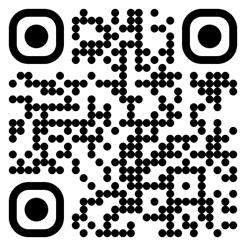

# QuickQR

> Fast, private, and ad-free QR code scanner for Android.

<p align="center">
  
</p>

<p align="center">
  <a href="https://github.com/nicemustafa/quickqr/releases"></a>
  <a href="LICENSE"></a>
  <a href="https://play.google.com/store/apps/details?id=net.mustafaer.quickqr"></a>
</p>

---

## ✨ Features

- ⚡ **Lightning-fast scanning** — point and scan instantly
- 🔍 **Smart detection** — automatically recognizes URLs, Wi-Fi, email, phone, and location QR codes
- 📋 **One-tap copy & open** — copy results to clipboard or open directly
- 📜 **Scan history** — keeps your last 20 scans with type icons, stored locally
- 📸 **Camera controls** — front/back switch & flashlight toggle
- 🌗 **Dark mode** — follows your system theme
- 📳 **Haptic feedback** — subtle vibration on successful scan
- 🔒 **Private** — no tracking, no analytics, no data collection
- 🚫 **Ad-free** — no ads, no in-app purchases, ever

## 📱 Supported QR Types

| Type | Icon | Action |
|------|------|--------|
| URL | 🔗 | Open in browser |
| Wi-Fi | 📶 | Detect network info |
| Email | ✉️ | Open mail client |
| Phone | 📞 | Open dialer |
| Location | 📍 | Open maps |
| Text | 📝 | Copy to clipboard |

## 🛠️ Tech Stack

- **Framework:** [Angular 20](https://angular.dev/) + [Ionic 8](https://ionicframework.com/)
- **Native:** [Capacitor 7](https://capacitorjs.com/)
- **Scanner:** [@zxing/ngx-scanner](https://github.com/nicemustafa/ngx-scanner) (QR Code, Data Matrix, Aztec)
- **Language:** TypeScript 5.8
- **Platform:** Android (minSdk 23)

## 🚀 Getting Started

### Prerequisites

- [Node.js](https://nodejs.org/) 18+
- [Android Studio](https://developer.android.com/studio) with SDK 35
- JDK 21

### Installation

```bash
# Clone the repository
git clone https://github.com/nicemustafa/quickqr.git
cd quickqr

# Install dependencies
npm install

# Build the web app
npm run build

# Sync with Android
npx cap sync android
```

### Development

```bash
# Start dev server
npm start

# Build for production
npm run build

# Sync & open in Android Studio
npx cap sync android
npx cap open android
```

### Run on Device

```bash
# Build + sync + run on connected device
npm run build && npx cap sync android && npx cap run android
```

## 📦 Project Structure

```
quickqr/
├── src/
│   ├── app/
│   │   ├── app.component.ts       # Main component with scanner logic
│   │   └── app.component.html     # UI template
│   ├── theme/
│   │   └── variables.scss          # Custom color palette
│   ├── global.scss                 # Global styles & animations
│   └── index.html
├── android/                        # Capacitor Android project
├── capacitor.config.ts             # Capacitor configuration
└── package.json
```

## 🤝 Contributing

Contributions are welcome! Please see [CONTRIBUTING.md](CONTRIBUTING.md) for guidelines.

## 📄 License

This project is licensed under the MIT License — see the [LICENSE](LICENSE) file for details.

## 👤 Author

**Mustafa ER**
- Website: [mustafaer.net](https://mustafaer.net)
- Email: mustafaerpro@gmail.com
- GitHub: [@nicemustafa](https://github.com/nicemustafa)

## 💖 Support

If you find QuickQR useful, consider supporting the project:

- ⭐ Star this repository
- ☕ [Buy me a coffee](https://www.buymeacoffee.com/mustafaer)
- 🎉 [Patreon](https://www.patreon.com/mustafaer)
